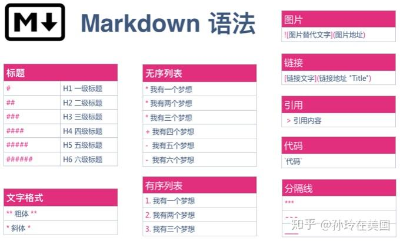

# Markdown使用说明

## 一、Markdown基础语法

### 1.字体



#### 1.1标题

|标题|注释|
|:------:|:-:|
|\# |一级标题|
|\##| 二级标题|

#### 1.2粗体和斜体

**粗体**
*斜体*

### 2.段落与换行

语法说明：

1. 如果行与行之间没有空行，则会被视为同一段落。
2. 如果行与行之间有空行，则会被视为不同段落。
3. 空行是指行内什么都没有，或者只有空格和制表符。
4. 如果想在段内换行，则需要在上一行的结尾插入两个以上的空格然后按回车。

#### 2.1列表

##### 有序列表

数字序列 + 英文句号 + 空格 + 列表内容

1. 我有一个梦想
2. 我有两个梦想
3. 我有三个梦想

##### 无序列表

*/+/- + 空格 + 列表内容

- 使用 ”-“ 标记
- 使用 ”*“ 标记
- 使用 ”+“ 标记

##### 嵌套列表

``` 注释
+ 第一层列表
TAB + 第二层列表
TAB + TAB + 第三次列表
```

#### 2.2

#### 2.3 排版技巧

##### 2.3.1 推荐的排版样式

##### 2.3.2 排版样式对比

##### 2.3.3 关于空格

1. 一些需要添加空格的情况

   - 英文标点（,.;:?）与后面的字符之间需要加空格66，与前面的字符之间不需要加空格
   示例： More ways to shop: Visit an Apple Store, call 1-800-MY-APPLE6, or find a reseller
   - 当在中文、英文种实用 >（半角）标识路径时，两边都需要加空格
   示例：设置 > 通用 > 还愿 > 抹掉所有内容和设置

2. 不加空格的情况

- 中文标点符号和数字、中文、英文之间不需要添加空格。
示例：MacBook Pro（15英寸，2016年年末）
- 数字和百分号之间不需要添加空格。
示例：集成图形处理器速度可比前代机型最高提升103%之多
- 数字和单位符号之间不需要添加空格。
示例：顺序读取速度最高可达 3.1GB/s，15 英寸机型首次提供 2TB 容量的固态硬盘配置
示例：配备 4MB 共享三级缓存
- 英文和数字组合成的名字之间不需要添加空格。
示例：双核 Intel Core i7 处理器
示例：iPhone 6s Plus 现有深空灰、银、金和玫瑰金四种颜色，配备 A9 芯片、3D Touch
- 当/（半角）标识“或”、“路径”时，与前后的字符之间均不加空格。
示例：小明精通 “Python/Java/Go/Swift” 的 Hello Word 打印语法
- 货币符号后不加空格
Apple will repair your device for a service price of $149
- 负号后不加空格
示例：3 - 5 = -2

##### 2.3.4 全角和半角

- 在中文排版中，要实用全角标点符号
示例：怒发冲冠，凭栏处，潇潇雨歇。
- 在英文排版中，要实用半角标点符号
Get support by phone, chat, or email, set up a repair, or make a Genius Bar appointment.

##### 2.3.5 正确的英文大小写

专业
正确：macOS、iPhone、iPad Pro、Macbook Pro、iOS、GitHub
