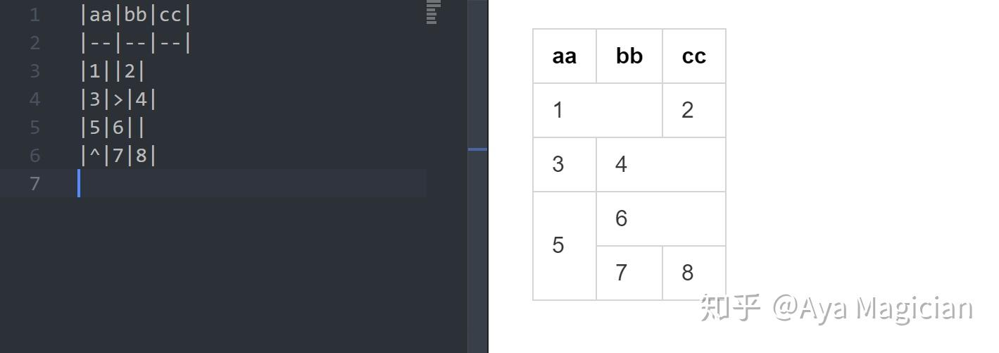

# 标记记号

**其次**是批注。MPE 支持用 `==` 来高亮一段文字。

==这是高亮==

==文字高亮==可以有效提升阅读体验。尤其是对于中文来说，粗体和斜体都不是很显眼，高亮是很实用的。

不仅如此，MPE 还支持 [CriticMarkup](https://link.zhihu.com/?target=http%3A//criticmarkup.com/users-guide.php) 进行更复杂的批注：

你可能觉得有了版本控制就不再需要批注。但我觉得批注有助于我们看清一个东西在不同时间段是什么样子、怎么变成了现在的样子，是很有用的。有一些信息不应该被隐藏在历史提交里，而应该让所有人很清楚地查到。

第三是单元格合并。这一点没有想象中有用，但偶尔还是会用到的。

|aa|bb|cc|
|--|--|--|
|1||2|
|3|>|4|
|5|6||
|^|7|8|

最后关于上下标、Emoji啥的就请大家自己尝试了。

L^A^T~E~X :smile:
