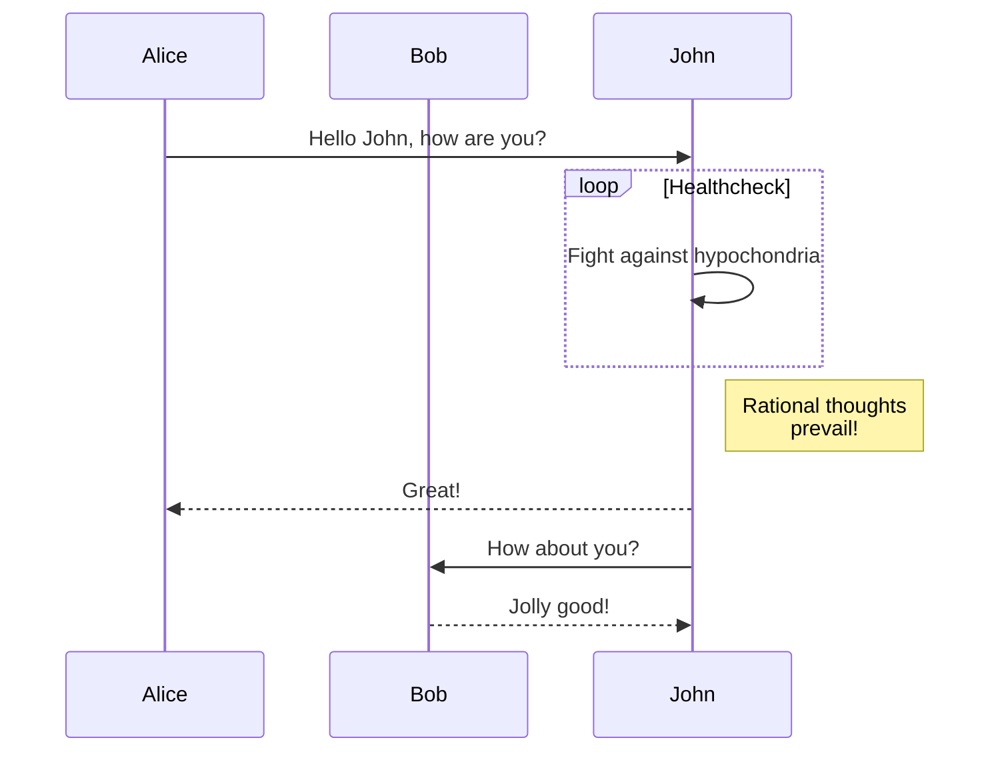
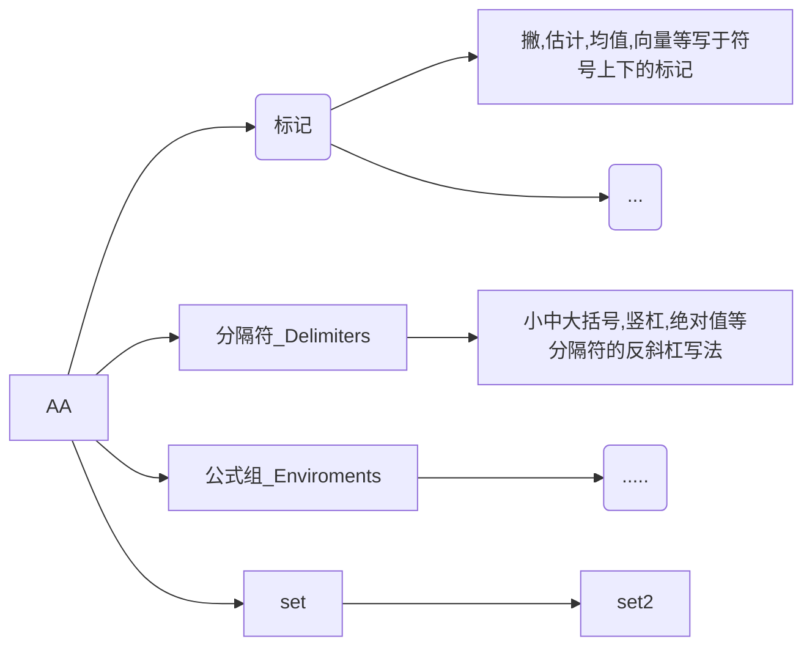
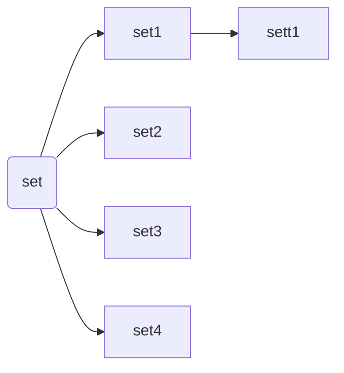
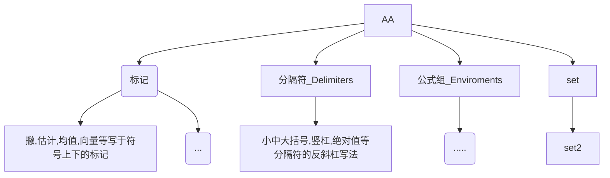
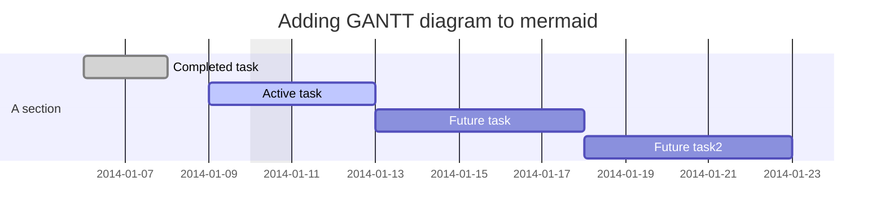
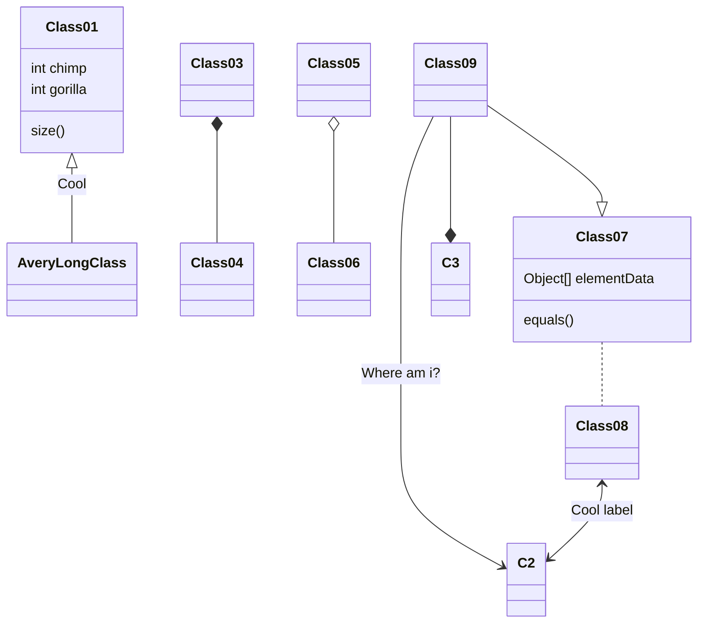

# 思维导图

??在CSDN等平台中可使用Mermaid来绘制思维导图。那么先简单介绍下Mermaid。Mermaid是一个用于画思维导图、流程图、状态图、时序图、甘特图等图的工具，使用 JavaScript 进行本地渲染。虽然Mermaid暂不支持思维导图的绘制，但是可通过绘制流程图来替代简单的思维导图。

原文链接：<https://blog.csdn.net/weixin_47532216/article/details/124437435>
图表文档：<http://mermaid.js.org/intro/>

## 流程图

## 序列图

## 横向思维导图

## 竖向思维导图

## 甘特图

## 类图

