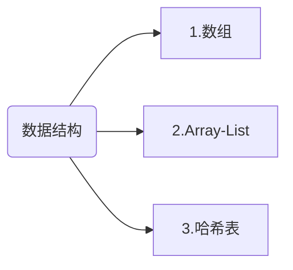
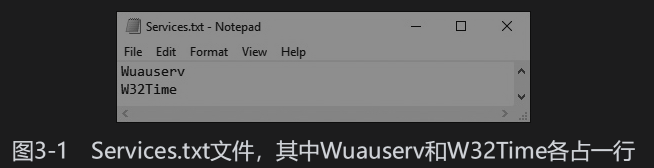
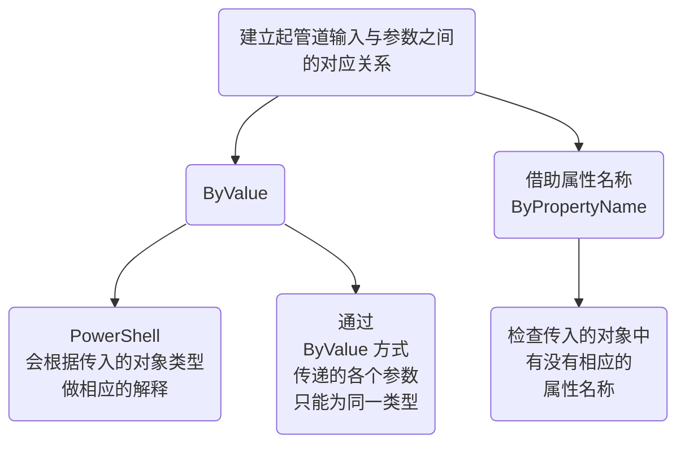

# 《PowerShell 实战》

## 推荐序

PowerShell 的特点

- 一致性的设计，语法、命名清晰明了
- 简单易学，能兼容现有的脚本程序和命令行工具
- 内置丰富的标准命令（cmd-let），在默认环境下即可完成常见的系统管理工作
- 具备完整的拓展体系（PowerShellGet）、庞大的模块和脚本市场（PowerShell Gallery）
- 完整的强类型支持。它构建在 .NET CLR 基础之上，能接受并返回.NET对象。对象甚至能在管道和进程之间传递。
- 最新的 PowerShell 7 是开源和跨平台的，其推动的不仅是一家企业的产品，二十整个行业。

## 前言

### 为什么使用 PowerShell

PowerShell 的目标是让用户通过脚本自动执行任务，无需学习计算机编程。

### 目标读者

IT 专业人士或系统管理员，每日疲于在一成不变的GUI中四处点击。

### 内容简介

实践教学法，具有大量示例和真实案例。
三部分

- 讲解 PowerShell 新手要掌握的知识
  - 第 1 ~ 7 章 介绍了 PowerShell语言本身
  - 第 8 章 价绍了如何用PowerShell远程处理功能连接远程计算机来执行命令
  - 第 9 章 ==介绍了留下的 PowerShell 测试框架 Pester==。这个框架贯穿本书，经常使用。

- 利用第一部分所学的知识来自动执行一些常见的任务
  - 第 10 ~ 13 章 讨论了如何解析结构化数据，以及很多IT管理员经常使用的服务。
  - 第 14 章 展示了如何构建工具，以便在自己的环境中清点服务器
- 重点构建了名为 PowerLab 的 PowerShell 模块，借此演示了 PowerShell 的功能。这部分涵盖优秀的模块设计方式以及与函数相关的最佳实践。
  - 第 15 ~ 20 章 介绍了如何使用 PowerShell 实现整个实验室的自动化，以及如何自动测试服务器环境。

## 第一部分 基础知识

### 第 1 章 上手体验

#### 1.1 打开 PowerShell 控制台

#### 1.2 使用 DOS 命令

命令|注释
:---:|:----:
TAB | 键补齐
cd | 进入目录
dir | 显示当前目录内容
cls | 清空屏幕

#### 1.3 探索 PowerShell 命令

命令分类

1. cmdlet
2. 函数
3. 别名
4. 外部脚本

Get-Command 命令

``` powershell
PS C:\Users\375563> get-command -name get-alias

CommandType     Name                                               Version    Source
-----------     ----                                               -------    ------
Cmdlet          Get-Alias                                          3.1.0.0    Microsoft.PowerShell.Utility
```

#### 1.4 获取帮助

##### 1.4.1 显示文档

``` powershell
PS C:\Users\375563> get-help add-content

名称
    Add-Content

摘要
    Adds content to the specified items, such as adding words to a file.


语法
    Add-Content [-Value] <System.Object[]> [-Credential <System.Management.Automation.PSCredential>] [-Encoding {AS
    CII | BigEndianUnicode | BigEndianUTF32 | Byte | Default | OEM | String | Unicode | Unknown | UTF7 | UTF8 | UTF
    32}] [-Exclude <System.String[]>] [-Filter <System.String>] [-Force] [-Include <System.String[]>] -LiteralPath
    <System.String[]> [-NoNewline] [-PassThru] [-Stream <System.String>] [-UseTransaction] [-Confirm] [-WhatIf] [<C
    ommonParameters>]

    Add-Content [-Path] <System.String[]> [-Value] <System.Object[]> [-Credential <System.Management.Automation.PSC
    redential>] [-Encoding {ASCII | BigEndianUnicode | BigEndianUTF32 | Byte | Default | OEM | String | Unicode | U
    nknown | UTF7 | UTF8 | UTF32}] [-Exclude <System.String[]>] [-Filter <System.String>] [-Force] [-Include <Syste
    m.String[]>] [-NoNewline] [-PassThru] [-Stream <System.String>] [-UseTransaction] [-Confirm] [-WhatIf] [<Common
    Parameters>]


说明
    The `Add-Content` cmdlet appends content to a specified item or file. Content can be passed in from the pipelin
    e or specified by using the Value parameter.

    If you need to create files or directories for the following examples, see New-Item (New-Item.md).

```

##### 1.4.2 学习一般主题

#### 1.5 更新文档

update-help

### 第 2 章 PowerShell 基本概念

“一切皆对象”

#### 2.1 变量

变量用于存储值

##### 2.1.1 显示及修改变量

变量以（$）开头
显示变量值

``` powershell
PS C:\Users\375563> $MaximumHistoryCount
4096
```

$MaximumHistoryCount 是一个内置变量，指明了 PowerShell 在命令历史中最多存储多少个命令，默认为4096个。

修改变量的值

``` powershell
PS C:\Users\375563> $MaximumHistoryCount = 200
PS C:\Users\375563> $MaximumHistoryCount
200
```

在 PowerShell 中变量分为两大类：

1. 用户定义的变量
2. 自动变量，即 PowerShell 自带的变量

##### 2.1.2 用户定义的变量

###### 启用严格模式

```powershell
set-strictmode -version latest
```

严格模式下，倘若违背良好的编程实践，PowerShell 将抛出错误。一般不启用
帮助

```powershell
get-help set-strictmode -examples
```

创建变量

```powershell
#color = 'bulu'
```

用 Set-Variable 命令创建一个变量
用 Get-Variavle 命令显示该变量的值

```powershell
PS C:\Users\375563> Set-Variable -name color1 -value bule1
PS C:\Users\375563> get-Variable -name color1

Name                           Value
----                           -----
color1                         bule1
```

Set-Variable 还可以返回所有可用变量

##### 2.1.3 自动变量

###### $null 变量

代表空值

代码清单2-8 为变量赋值$null

```shell
PS C:\WINDOWS\system32> $foo = $null
PS C:\WINDOWS\system32> $foo
PS C:\WINDOWS\system32> $bar
检索不到变量“$bar”，因为未设置该变量。
所在位置 行:1 字符: 1
+ $bar
+ 
    + CategoryInfo          : InvalidOperation: (bar:String) []，RuntimeException
    + FullyQualifiedErrorId : VariableIsUndefined
```

代码清单2-9 用Get-Variable命令查找变量

```shell
PS C:\WINDOWS\system32> get-variable -name foo

Name                           Value
----                           -----
foo


PS C:\WINDOWS\system32> get-variable -name bar
get-variable : 找不到名为“bar”的变量。
所在位置 行:1 字符: 1
+ get-variable -name bar
+ ~~~~~~~~~~~~~~~~~~~~~~
    + CategoryInfo          : ObjectNotFound: (bar:String) [Get-Variable], ItemNotFoundException
    + FullyQualifiedErrorId : VariableNotFound,Microsoft.PowerShell.Commands.GetVariableCommand
```

$null 非常有用

###### $LASTEXITCODE 变量

程序运行结束后会返回一个**退出码**（或称作返回码）一般 0 表示成功。
$LASTEXITCODE 变量的值始终是最后执行那个程序的退出码。

```shell
PS C:\WINDOWS\system32> ping.exe -n 1 dfdfdf.com

正在 Ping hdr-nlb5-4e815dd67a14bf7f.elb.us-east-2.amazonaws.com [3.130.253.23] 具有 32 字节的数据:
请求超时。

3.130.253.23 的 Ping 统计信息:
    数据包: 已发送 = 1，已接收 = 0，丢失 = 1 (100% 丢失)，
PS C:\WINDOWS\system32> ping.exe -n 1 10.68.2.31

正在 Ping 10.68.2.31 具有 32 字节的数据:
来自 10.68.2.31 的回复: 字节=32 时间=6ms TTL=62

10.68.2.31 的 Ping 统计信息:
    数据包: 已发送 = 1，已接收 = 1，丢失 = 0 (0% 丢失)，
往返行程的估计时间(以毫秒为单位):
    最短 = 6ms，最长 = 6ms，平均 = 6ms
```

###### 偏好设置变量

这类变量用于控制各种输出流的默认行为
包括Error、 Warning、Verbose、Debug和Information

#### 2.2 数据类型

PowerShell 有多种数据类型，包括布尔值、字符串和整数，而且修改变量的数据类型不会报错。

```shell
PS C:\Users\375563> $foo =1
PS C:\Users\375563> $foo = 'one'
PS C:\Users\375563> $foo = $true
```

##### 2.2.1 布尔值

在 PowerShell 中，布尔值称作 bools，分别使用 $true 和 $false 表示

```shell
PS C:\Users\375563> $isOn = $true
PS C:\Users\375563> $isOn
True
```

##### 2.2.2 整数和浮点数

- 整数类型
  - 小数部分会四舍五入
  - 有正负号
  - Int32 (-2147483648,2147483647)
  - Int64 (-9223372036854775808,9223372036854775807)

```shell
  PS K:\vscode\jieiyu-markdown-note> $num = 1
PS K:\vscode\jieiyu-markdown-note> $num    
1
PS K:\vscode\jieiyu-markdown-note> $num.GetType().name
Int32
PS K:\vscode\jieiyu-markdown-note> $num = 1.5
PS K:\vscode\jieiyu-markdown-note> $num.GetType().name
Double
PS K:\vscode\jieiyu-markdown-note> [Int32]$num
2
```

- 浮点数数据类型
  - Double

##### 2.2.3 字符串

- 合并字符串和变量

```shell
PS K:\vscode\jieiyu-markdown-note> $language = 'PowerShell'
PS K:\vscode\jieiyu-markdown-note> $color = 'blue'
PS K:\vscode\jieiyu-markdown-note> $sentence = "Today $color" 
PS K:\vscode\jieiyu-markdown-note> $sentence
Today blue
PS K:\vscode\jieiyu-markdown-note> $color = 'blue2'
PS K:\vscode\jieiyu-markdown-note> $sentence
Today blue
PS K:\vscode\jieiyu-markdown-note> $sentence = "Today $color"
PS K:\vscode\jieiyu-markdown-note> $sentence
Today blue2
```

- 单引号与双引号

#### 2.3 对象

一切皆对象。
对象是某个模板的单个实例。这个模板称为类，指明了对象包含的东西。
滴哦下哦昂所属的类决定其有哪些方法可用。

##### 2.3.1 查看属性

```shell
PS K:\vscode\jieiyu-markdown-note> $color = 'red'
PS K:\vscode\jieiyu-markdown-note> $color
red
PS K:\vscode\jieiyu-markdown-note> Select-Object -InputObject $color -Property *

Length
------
     3


PS K:\vscode\jieiyu-markdown-note> $color.Length
3'
```

##### 2.3.2 使用 Get-Member cmdlet

```shell
PS K:\vscode\jieiyu-markdown-note> Get-Member -InputObject $color


   TypeName:System.String

Name             MemberType            Definition
----             ----------            ----------
Clone            Method                System.Object Clone(), System.Object ICloneable.Clone()
CompareTo        Method                int CompareTo(System.Object value), int CompareTo(string strB), int IComparable.CompareTo(System.Object obj), int IComparable[string].CompareTo(string other)
Contains         Method                bool Contains(string value)
CopyTo           Method                void CopyTo(int sourceIndex, char[] destination, int destinationIndex, int count)
EndsWith         Method                bool EndsWith(string value), bool EndsWith(string value, System.StringComparison comparisonType), bool EndsWith(string value, bool ignoreCase, cultureinfo culture)
Equals           Method                bool Equals(System.Object obj), bool Equals(string value), bool Equals(string value, System.StringComparison comparisonType), bool IEquatable[string].Equals(string other)
GetEnumerator    Method                System.CharEnumerator GetEnumerator(), System.Collections.IEnumerator IEnumerable.GetEnumerator(), System.Collections.Generic.IEnumerator[char] IEnumerable[char].GetEnumerator()        
GetHashCode      Method                int GetHashCode()
GetType          Method                type GetType()
GetTypeCode      Method                System.TypeCode GetTypeCode(), System.TypeCode IConvertible.GetTypeCode()
IndexOf          Method                int IndexOf(char value), int IndexOf(char value, int startIndex), int IndexOf(string value), int IndexOf(string value, int startIndex), int IndexOf(string value, int startIndex, int ... 
IndexOfAny       Method                int IndexOfAny(char[] anyOf), int IndexOfAny(char[] anyOf, int startIndex), int IndexOfAny(char[] anyOf, int startIndex, int count)
Insert           Method                string Insert(int startIndex, string value)
IsNormalized     Method                bool IsNormalized(), bool IsNormalized(System.Text.NormalizationForm normalizationForm)
LastIndexOf      Method                int LastIndexOf(char value), int LastIndexOf(char value, int startIndex), int LastIndexOf(string value), int LastIndexOf(string value, int startIndex), int LastIndexOf(string value, ... 
LastIndexOfAny   Method                int LastIndexOfAny(char[] anyOf), int LastIndexOfAny(char[] anyOf, int startIndex), int LastIndexOfAny(char[] anyOf, int startIndex, int count)
Normalize        Method                string Normalize(), string Normalize(System.Text.NormalizationForm normalizationForm)
PadLeft          Method                string PadLeft(int totalWidth), string PadLeft(int totalWidth, char paddingChar)
PadRight         Method                string PadRight(int totalWidth), string PadRight(int totalWidth, char paddingChar)
Remove           Method                string Remove(int startIndex, int count), string Remove(int startIndex)
Replace          Method                string Replace(char oldChar, char newChar), string Replace(string oldValue, string newValue)
Split            Method                string[] Split(Params char[] separator), string[] Split(char[] separator, int count), string[] Split(char[] separator, System.StringSplitOptions options), string[] Split(char[] separ...
StartsWith       Method                bool StartsWith(string value), bool StartsWith(string value, System.StringComparison comparisonType), bool StartsWith(string value, bool ignoreCase, cultureinfo culture)
Substring        Method                string Substring(int startIndex), string Substring(int startIndex, int length)
ToBoolean        Method                bool IConvertible.ToBoolean(System.IFormatProvider provider)
ToByte           Method                byte IConvertible.ToByte(System.IFormatProvider provider)
ToChar           Method                char IConvertible.ToChar(System.IFormatProvider provider)
ToCharArray      Method                char[] ToCharArray(), char[] ToCharArray(int startIndex, int length)
ToDateTime       Method                datetime IConvertible.ToDateTime(System.IFormatProvider provider)
ToDecimal        Method                decimal IConvertible.ToDecimal(System.IFormatProvider provider)
ToDouble         Method                double IConvertible.ToDouble(System.IFormatProvider provider)
ToInt16          Method                int16 IConvertible.ToInt16(System.IFormatProvider provider)
ToInt32          Method                int IConvertible.ToInt32(System.IFormatProvider provider)
ToInt64          Method                long IConvertible.ToInt64(System.IFormatProvider provider)
ToLower          Method                string ToLower(), string ToLower(cultureinfo culture)
ToLowerInvariant Method                string ToLowerInvariant()
ToSByte          Method                sbyte IConvertible.ToSByte(System.IFormatProvider provider)
ToSingle         Method                float IConvertible.ToSingle(System.IFormatProvider provider)
ToString         Method                string ToString(), string ToString(System.IFormatProvider provider), string IConvertible.ToString(System.IFormatProvider provider)
ToType           Method                System.Object IConvertible.ToType(type conversionType, System.IFormatProvider provider)
ToUInt16         Method                uint16 IConvertible.ToUInt16(System.IFormatProvider provider)
ToUInt32         Method                uint32 IConvertible.ToUInt32(System.IFormatProvider provider)
ToUInt64         Method                uint64 IConvertible.ToUInt64(System.IFormatProvider provider)
ToUpper          Method                string ToUpper(), string ToUpper(cultureinfo culture)
ToUpperInvariant Method                string ToUpperInvariant()
Trim             Method                string Trim(Params char[] trimChars), string Trim()
TrimEnd          Method                string TrimEnd(Params char[] trimChars)
TrimStart        Method                string TrimStart(Params char[] trimChars)
Chars            ParameterizedProperty char Chars(int index) {get;}
Length           Property              int Length {get;}
```

##### 2.3.3 调用方法

查看字符串的 Remobe() 方法

```shell
   TypeName:System.String

Name   MemberType Definition
----   ---------- ----------
Remove Method     string Remove(int startIndex, int count), string Remove(int startIndex)
```

调用方法

```shell
PS K:\vscode\jieiyu-markdown-note> $color.Remove(1,1)
rd
PS K:\vscode\jieiyu-markdown-note> $color            
red
```

#### 2.4 数据结构

数据结构



##### 2.4.1 数组

###### 定义数组

```shell
PS K:\vscode\jieiyu-markdown-note> $colorPicker = @('blue','white','yellow','black')
PS K:\vscode\jieiyu-markdown-note> $colorPicker
blue
white
yellow
black
```

###### 读取数组元素

```shell
PS K:\vscode\jieiyu-markdown-note> $colorPicker[0]
blue
```

访问多个元素

```shell
PS K:\vscode\jieiyu-markdown-note> 1..3           
1
2
3
PS K:\vscode\jieiyu-markdown-note> $colorPicker[1..3]
white
yellow
black
```

###### 将元素添加到数组

```shell
PS K:\vscode\jieiyu-markdown-note> $colorPicker = $colorPicker + ‘orange'
PS K:\vscode\jieiyu-markdown-note> $colorPicker
blue
white
yellow
black
orange
```

使用 +=

```shell
PS K:\vscode\jieiyu-markdown-note> $colorPicker += ‘brown'
PS K:\vscode\jieiyu-markdown-note> $colorPicker
blue
white
yellow
black
orange
brown
```

##### 2.4.2 ArrayList

ArrayList 的大小在添加或删除元素后可动态调整，处理大量数据时性能十分优越。

创建 ArrayList

```shell
PS K:\vscode\jieiyu-markdown-note> $colorPicker = [System.Collections.ArrayList]@('blue','white','yellow','black')
PS K:\vscode\jieiyu-markdown-note> $colorPicker
blue
white
yellow
black
```

###### 将元素添加到ArrayList

```shell
PS K:\vscode\jieiyu-markdown-note> $colorPicker.Add('gray')
4
PS K:\vscode\jieiyu-markdown-note> $null = $colorPicker.Add('gray')  //防止输出
PS K:\vscode\jieiyu-markdown-note> $colorPicker
blue
white
yellow
black
gray
gray
```

###### ArrayList 中删除元素

```shell
PS K:\vscode\jieiyu-markdown-note> $null = $colorPicker.Remove('gray') 
PS K:\vscode\jieiyu-markdown-note> $colorPicker
blue
white
yellow
black
gray
```

可以通过值本身来引用元素，如果有多个相同，会删除离开头最近的元素。

##### 2.4.3 哈希表

两个数据对应――哈希表（字典）
组键-值对

###### 创建哈希表

```shell
PS> $users = @{
    abertram = 'Adam Bertram';
    raquelcer = 'Raquel Cerillo';
    zheng21 = 'Justin Zheng'
}
PS> $users
Name                           Value
----                           -----
abertram                       Adam Bertram
raquelcer                      Raquel Cerillo
zheng21                        Justin Zheng
```

PowerShell不允许创建有重复键的哈希表，每一个键都要唯一指向一个值。值可以是一个数组，甚至另一个哈希表。

###### 从哈希表中读取元素

代码清单2-35　访问哈希表中的值

```shell
PS> $users['abertram']
Adam Bertram
PS> $users.abertram
Adam Bertram
```

如果想查看一个哈希表（或其他任何对象）的所有属性，可以执行下列命令。

```shell
PS> Select-Object -InputObject $yourobject -Property *
```
代码清单2-37　向哈希表中添加元素

```shell
PS> $users.Add('natice', 'Natalie Ice')
PS> $users['phrigo'] = 'Phil Rigo'
```

代码清单2-38　检查哈希表中的元素[插图]

```shell
PS> $users.ContainsKey('johnnyq')
False
```

确认哈希表中存在相应的键后，使用一个等号即可修改对应的值，如代码清单2-39所示。代码清单2-39　修改哈希表中的值[插图]

```shell
PS> $users['phrigo'] = 'Phoebe Rigo'
PS> $users['phrigo']
Phoebe Rigo
```

我们知道向哈希表中添加元素有两种方法。但从哈希表中删除元素只有一种方法，如接下来的内容所述。?从哈希表中删除元素与ArrayList一样，哈希表也有Remove()方法。调用该方法，传入想删除的元素的键即可，如代码清单2-40所示。代码清单2-40　从哈希表中删除元素[插图]

```shell
PS> $users.Remove('natice')
```

至此用户应该少了一个，可以调用这个哈希表确认一下。记住，可以使用Keys属性查看有哪些键。

#### 2.5 自定义对象

代码清单2-41　用New-Object自定义对象

```shell
PS> $myFirstCustomObject = New-Object -TypeName PSCustomObject
```

代码清单2-42　用PSCustomObject类型校正自定义一个对象

```shell
PS> $myFirstCustomObject = [PSCustomObject]@{OSBuild = 'x'; OSVersion = 'y'}
```

如代码清单2-42所示。这里我们定义了一个哈希表，其中键是属性名，值是属性的值，然后再将类型校正为PSCustomObject。

代码清单2-43　查看一个自定义对象的属性和方法

```shell
PS> Get-Member  -InputObject $myFirstCustomObject
    TypeName: System.Management.Automation.PSCustomObject
Name        MemberType   Definition
----        ----------   ----------
Equals      Method       bool Equals(System.Object obj)
GetHashCode Method       int GetHashCode()
GetType     Method       type GetType()
ToString    Method       string ToString()
OSBuild     NoteProperty string OSBuild=OSBuild
OSVersion   NoteProperty string OSVersion=Version
```

访问数据

```shell
PS> $myFirstCustomObject.OSBuild
x
PS> $myFirstCustomObject.OSVersion
y
```

PSCustomObject
PS自定义对象

### 第 3 章 组合命令

#### 3.1 启动一个 Windows 服务

代码清单3-1　查找一项服务，然后通过Name参数启动

```shell
PS> $serviceName = 'wuauserv'
PS> Get-Service -Name $serviceName
Status   Name               DisplayName
------   ----               -----------
Running  wuauserv           Windows Update
PS> Start-Service -Name $serviceName
```

先执行Get-Service命令是为了确保PowerShell不抛出任何错误。我们想启动的服务可能已经正在运行，此时，Start-Service会直接将控制权返回给控制台。

#### 3.2 使用管道

```shell
PS> command1 | command2
```

PowerShell管道的独特之处是，传递的不仅仅是字符串，还可以是==对象==。

代码清单3-2　将现有服务通过管道传给Start-Service命令

```shell
PS> Get-Service -Name 'wuauserv' | Start-Service
```

如果愿意，还可以将代码清单3-2重写为一个参数也不使用。

```shell
PS> 'wuauserv' | Get-Service | Start-Service
```



如果想在PowerShell窗口中显示这个文件的内容，可以使用Get-Content cmdlet的Path参数。

```shell
PS> Get-Content -Path C:\Services.txt
Wuauserv
W32Time
```

Get-Content命令会逐行读取文件，分别将各行添加到一个数组中，然后返回该数组。代码清单3-3使用管道将Get-Content返回的数组传给了Get-Service命令。

```shell
PS> Get-Content -Path C:\Services.txt | Get-Service
Status   Name               DisplayName
------   ----               -----------
Stopped  Wuauserv           Windows Update
Stopped  W32Time            Windows Time
```

Get-Content命令会读入文本文件的内容，并生成一个数组。但是，PowerShell并不会通过管道发送数组本身，而会将数组拆包，通过管道一一发送其中的每个元素。

通过管道串联在一起的命令数量没有限制。不过，一旦超过五个，就应该重新审视了。注意，虽然管道很强大，但不是任何情况下都可以使用。多数PowerShell命令只接受特定类型的管道输入，有些命令甚至根本不接受管道输入。下一节将阐明参数绑定，探讨PowerShell处理管道输入的方式。

##### 3.2.3 参数绑定

如果命令的任何一个参数都不支持管道，或者PowerShell找不到适当的绑定，那么通过管道传递信息就会导致错误。例如，可以尝试执行下列命令。

```shell
PS> 'string' | Get-Process
Get-Process : The input object cannot be bound to any parameters for the command either...
--snip--
```

PowerShell会通过两种方式建立起管道输入与参数之间的对应关系。



（比如这里的ComputerName），如果有，就将属性的值作为参数的值。综上所述，如果想同时将服务名称和计算机名称传给Get-Service命令，则需要创建一个PSCustomObject对象，并传入该对象，如代码清单3-6所示。

```shell
PS> $serviceObject = [PSCustomObject]@{Name = 'wuauserv'; ComputerName = 'SERV1'}
PS> $serviceObject | Get-Service
```

#### ==3.3 编写脚本==

```shell
PS> C:\FolderPathToScript\script.ps1
Hello, I am in a script!
```

##### 3.3.1 设置执行策略

在默认情况下，PowerShell不允许运行任何脚本。如果在默认的安装环境中尝试运行外部脚本，那么PowerShell会报错，如代码清单3-8所示。

代码清单3-9　执行Get-ExecutionPolicy命令，显示当前执行策略

```shell
PS> Get-ExecutionPolicy
Restricted
```

代码清单3-10　用Set-ExecutionPolicy命令修改执行策略,需要管理员身份执行

```shell
PS C:\Windows\system32> Set-ExecutionPolicy -ExecutionPolicy RemoteSigned

执行策略更改
执行策略可帮助你防止执行不信任的脚本。更改执行策略可能会产生安全风险，如 https:/go.microsoft.com/fwlink/?LinkID=135170
中的 about_Execution_Policies 帮助主题所述。是否要更改执行策略?
[Y] 是(Y)  [A] 全是(A)  [N] 否(N)  [L] 全否(L)  [S] 暂停(S)  [?] 帮助 (默认值为“N”): a
PS C:\Windows\system32> Get-ExecutionPolicy
RemoteSigned
```

##### 使用 PowerShell ISE

第一行代码

```shell
Write-Host 'Hello, I am in a script!'
```

执行代码

``` shell
PS K:\vscode\jieiyu-markdown-note\读书笔记\PowerShell\脚本> .\script.ps1        
Hello, I am in a script!
```

### 第 4 章 控制流

if/then语句、switch语句以及各种循环，为代码增添必要的灵活性

#### 4.1 理解控制流

控制流背后的基本思想：即根据预定的逻辑执行不同指令序列的能力。