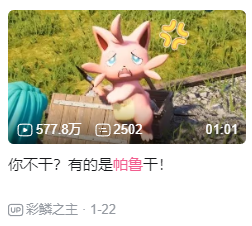
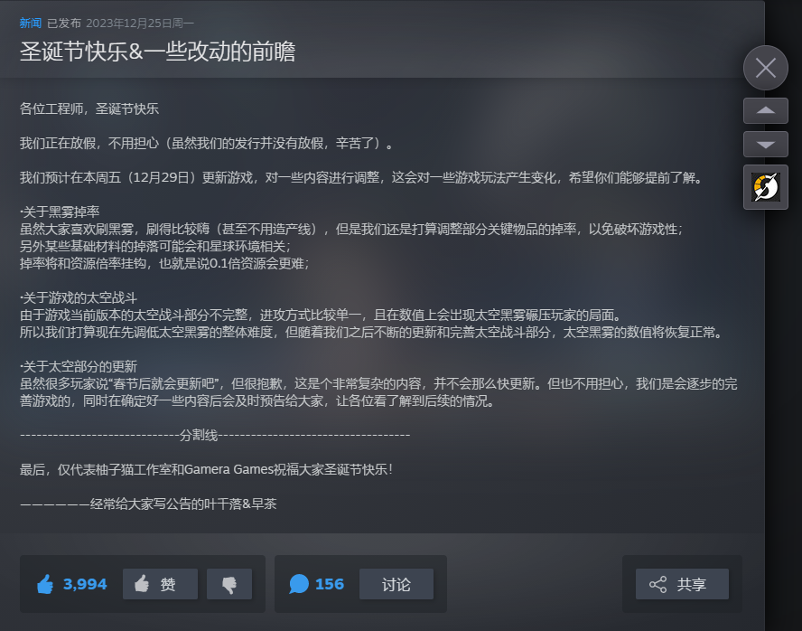

# 玩帕鲁看1984有感杂谈――幻兽帕鲁、戴森球计划、缺氧

这是《1984》这本书中的一段话。

>“然而最重要的，是这些地区拥有永不枯竭的廉价劳动力储备。不管哪个国家，只要占领了赤道非洲或者中东地区，或者印度南部，或者印度尼西亚群岛，就同时能够支配几千万乃至几亿廉价而勤劳的苦力。这些地区的居民多少被公开置于被奴役的地位。”

帕鲁似乎就是文中所说的劳动力，帕鲁大陆则是被召唤师所占领。这段话我联想到的便是人口红利，为什么人口红利要比机器强？为什么大企业明明可以全力发展机械，却依然需要吃人口红利，去那些成本低的地区开工厂？

- 首先，你不干有的是帕鲁干!

帕鲁不干了，换一只就好了，机器可不行，停了就要修，还需要有人对机器进行维护。
- 其次，帕鲁不需要培养，培养起来的极品一级采矿速度不如普通的白板二级，每升一级，工作效率提升至300%，所以培养低级的不如直接抓高级的来干活。机器的话肯定要投入巨大成本，就相当于培养时间了，对应商人来说，人口红利这回本这么快，当然偏向人口红利。机器的优势是高投入高产出，边投机械边吃人口红利那不更好。

再对比异星工厂，异星工厂是一个人搭建巨型流水线，这可没人口红利，相应的便是前期难受，后期舒服，所以留下就是老玩家，走了就是没通过新手教程玩不下去的萌新。帕鲁则是上手就来，太简单了，自己就会去找活干，机器的话我还要指定。玩了太多工厂游戏，都是自己搭产线，突然上来一个可以当老板吃人口红利的游戏，这可能也是爆火的其中一个原因吧。之前有个猴子游戏也是可以让猴子去干活，但那个游戏的猴子纯单线程，太蠢了，要玩家手动教，只能干一件事情，还干不好，最后还没几只猴子，爽不起来，之后也就没什么声音了。

还有一个游戏，缺氧，带领你的复制人打造你的基地，并活下去，这虽然你的角色是老板，但并感受不到人口红利带来的好处，首先就是复制人来的太慢，而且到后期之后人越多游戏越卡，就体会不到人多带来的优势了。当然在缺氧中当黑心资本家也是可以的，但是对比帕鲁，还是显得太不人道了，而且很多都是蹭游戏机制实现的，一般玩家玩不到。所以玩缺氧没有指挥帕鲁这种新鲜感。

幻兽帕鲁是缝合怪游戏，确实是玩法丰富，但是玩完了之后感觉不上是有多丰富，一个玩法丰富的游戏，不到100个小时就没有新鲜感了，好像有点说不过去。其实本质还是一个练级打怪的游戏。我看了一下 b站 播放最多的帕鲁视频是577W，你不干有的是帕鲁干，播放高的大部分都是和帕鲁干活相关的。一个刷级游戏变成了资本家模拟器，这个游戏的时常也就基本取决于什么时候招到最顶级的员工了。

## 回想了一些我玩过的这么多模拟经营游戏，究竟有哪些是和帕鲁一样自己会去找事情做的呢？

- 冒险村物语，里面的人物会自己打怪练级，打怪掉的钱直接给玩家，但似乎不够。这个游戏很好玩，玩了很多遍，同样是养角色打怪的游戏，但打工的元素还是太少了。
- 缺氧，这似乎是最符合的，但是全要玩家自己下达命令，是最像帕鲁的游戏机制。但是缺氧还有很多系统要考虑，温度、水、气压等，远没有帕鲁那么简单，炼钢的模块就需要玩家花费大量精力去研究，搭建模块是缺氧的一个核心玩法，但帕鲁不是。帕鲁是精简化的，食物、炼钢，都一个机器搞定，玩家只需要点两下。在缺氧中，食物要考虑种植位置的气体种类、气压、肥料、液体、温度，甚至还有种子的基因。炼钢又需要先了解游戏中的核心温度机制，通过搭建降温系统来实现炼钢，同时还需要考虑炼钢效率问题，效率提升没帕鲁的一级二级三级这么明显，所以只能在模块优化上进行改进，一个精炼器改成两个，低温水和高温水加缓存，增加降温模块的液冷机数量，确保蒸汽机能够供得起降温等等因素。虽然缺氧也能培养复制人，但是这个培养可以说是该有的都有，但见不到大幅度提升，玩家收到的反馈很少，能感觉到稳步增加，但是随着进度的推进，工作内容越来越多，这点提升是感觉不出来的。同样是进度条，缺氧因为很多时间花在赶路上，感觉不出来，帕鲁的进度条就很明显，每一级的提升都是巨大的，就很容易给玩家正反馈。

突然想到还有一点，帕鲁这个缝合，是工厂 + 打怪，工作是为打怪辅助的，对应的内容就是养一只打架的帕鲁以及玩家带在身上的工具帕鲁。就像极了统治阶级的一个集团，是一群帕鲁养这几个帕鲁。工厂与打怪互补这个点确实很多游戏是没有的。比如缺氧的 dlc 是建造火箭去其他星球获取资源，但是我没有这些资源一样可以玩到通关，这样我就没有动力去探索其他星球了，本来是应该互补的优势没有体现出来，本质走的还是 dlc 之前的路：造火箭是为了获取一些资源，但不影响我火箭不获取资源直接通关。

既然讲到这里了，戴森球倒是这个做的比较好的，玩缺氧我就不想去别的球，但是戴森球我就经常飞来飞去，其他星球有什么好的呢？

1. 稀有资源，只有远处的星球有，走的是获取资源。和缺氧不同的，稀有资源很分散而且种类很多，获取之后的收益远比缺氧拿来做冷却剂大，更是有些非去不可的，比如硫酸海。
2. 地皮，本来的星球位置不够了，我需要开疆拓土，缺氧地图太大明显没必要，而且基地大了效率会降低。
3. 稀有星球，如潮汐锁定，这种星球一面始终朝向太阳，不用说了吧，是神。
4. 高光度的太阳，这就是追求建造戴森球所需要找的了，而且不同的太阳颜色不一样，能造出不同效果的球。
5. 不同的生态环境，有些球是真的很好看，莲花池球是真的好看，即使不在这里建家，很多玩家应该都和我一样愿意登陆来看看风景。
6. 黑雾，目前黑雾也就是数量上的差距，掉落物就差几个没什么用的，之后更新可能会出现更多的差异吧。比如不同生态环境下的黑雾基地有些特色建筑之类的（好像不太合逻辑）。但是黑雾本身就是变异出来的，地面上的黑雾为了适应环境也进行了部分变异，好像又合理起来了。有大气层的地方可以有个天气控制器，每过一段时间就对玩家的基地进行破坏这种。

讲到黑雾，刚更新时，黑雾的热度很高，是不是像黑雾在给我们打工？黑雾是不是就是帕鲁？那个时候玩家们玩的都挺爽的，但是之后有一次更新就破坏了这种体验

这次关于黑雾掉率的更新确实是提高了平衡性，但是同时破坏了玩家的热情以及游戏体验，可以说是之前玩家造的黑雾分拣系统直接报废了。为什么报废了，因为更新后黑雾掉落物低了不知道多少倍，我自己的存档开的是无尽资源，按更新来说应该掉落更多了才对，至少也是掉落翻倍吧，但是更新前掉落物能跑满5条极速传送带，更新后就连 1 条都跑不满了。也许之前掉落这么多算bug，但确实有游戏体验，现在这个掉落基本就是让黑雾掉落物不可玩了，除非单独找个球养黑雾（实际测试掉落物也少的很）。以前的掉落足够供得起科研站，现在却想供上一个都难。就破坏了打黑雾和发展的循环关系，变成了建工厂，然后打黑雾。同样的，异星工厂也是建工厂，然后打虫子。打虫子没有任何收益。戴森球在掉落减少后也可以近似看作没有收益，唯一的收益就是黑雾科技了（更新前掉落太多，一般都是关闭掉落的），靠黑雾刷材料完全不及拍条产线。再看回帕鲁，打怪和工厂是循环的，你去打 boss，抓回来基本就是生产力的大提升，前面说了 2 级的工作能力远大于 1 级，对应的 boss 等级越高，自然会的技能等级可能也就更高一些。生产力提升带来实力的提升，实力的提升又带来生产力的提升，这是正反馈循环，不难理解为什么帕鲁开始玩了就停不下来，通关之后就觉得腻了，实力已经到顶了，这个循环就被打破了。探索地图本身目的也就是提升实力和提高生产力，箱子开极品装备，野外抓高工作能力的帕鲁。

我没玩过方舟，玩过方块方舟，游戏核心应该都是一样的，升级自己的战力，打boss，推进度。打完 boss 解锁新的生产方式以及道具，那生产力是提升了，但玩家感觉不到，实力提升了，但玩家也感觉不到，因为进度是同步推进的。这可能也是我不怎么喜欢玩泰拉的原因，玩的时候就感觉一直在刷材料，进入了下一个阶段，上个阶段的武器就被抛弃，打一只boss换一把武器，感觉在重复，boss基本都是靠装备碾压打过去的。

帕鲁则是因为 boss 是获取帕鲁很好的办法，固定点刷新，所以会来多抓几次，那每次都能感觉自己比之前强了，同时抓了回去放家里还能提高生产力，带来的正反馈可比反复打boss刷材料强多了。帕鲁的升星和个体值其实都是锦上添花的作用，都是围绕着两个点的，也就是实力和生产力。只能说帕鲁缝合缝的真的是恰当好处，缝的都是围绕核心的，核心内容没有多余没用的东西。
