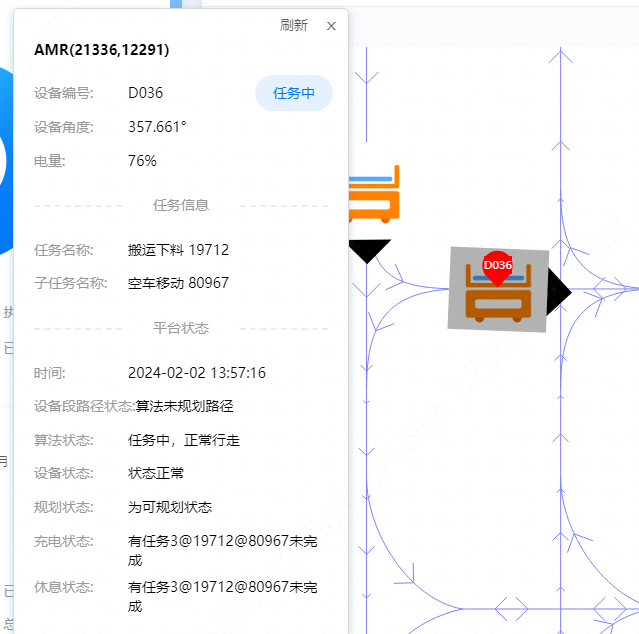

# 常见问题处理

## 第一部分 基础操作

### 第一章 AGV 设备基础操作

#### 1.1 设备连接方法

- 远程ssh连接
  - 使用 CMD 或 MobaXterm 软件，使用 ssh 连接，连接上后可进行终端操作，设备为 Ubuntu 系统，需自行学习 linux 相关基础知识。
  - 例：```ssh dahua@10.68.177.41```
  - 在连接后需要输入密码：```123$iRAY567*```
- 设备有线直连
  - usb端连接设备
    - 需修改电脑网段与 10.35.36.250 位于同一网段
      - 修改电脑网段的操作步骤：设置 > 网络和 Internet > 高级网络设置 > 相关设置 > 更多网络适配器选项
      - 找到有线连接对应的以太网
      - 更改 Internet 协议版本 4（TCP/IPv4）
      - 使用下面的 IP 地址（S）：

    描述|配置地址
    :--:|--
    IP 地址  （I）：|10.35.36.111
    子网掩码  （U）：|255.255.255.0
    默认网关  （D）：|10.35.36.254     （默认为 0.0.0.0）

    - 例：
      - 修改电脑网段为 10.35.36.111 后进行 ssh 连接操作
      - ```ssh dahua@10.35.36.250```
  - 网线端连接设备
    - 需修改电脑网段与 192.168.23.1 位于同一网段
    - 例：
      - 修改电脑网段为 192.168.23.111 后进行 ssh 连接操作
      - ```ssh dahua@192.168.23.1```

#### 1.2 systools 工具

在输入 systools 后可以看到介绍

``` bash
[10.68.176.12]@~$ systools
系统工具箱，集成系统调试相关工具。使用：systools [OPTION]
        net     --> 网络状态
        camera  --> 相机状态
        laser   --> 激光状态
        tof     --> TOF状态
        upgrade --> 升级异常排查
        boot    --> 系统启动和关闭记录
        hist    --> 命令执行记录
        h2offt  --> 更新bios版本到APL_Z09_CAMERA_T8G_26_SVID.bin
        backup  --> 将设备私有数据(标定数据等)压缩打包到当前目录
        dev5g   --> 检查当前设备中5G模组的状态

```

可以使用该工具简单查看设备情况

```bash
[10.68.176.12]@~$ systools net
1. RTL8821AU模块硬件已经识别
2. 无线网络连接成功
3. SSID: dahuaagv_5g
4. IP: 10.68.176.12 mask: 255.255.252.0 路由: 10.68.179.254
5. 信号良好，信号强度 RSSI: -38
6. NetApp已开启
  |-- 设备路由与Netapp设置是一致
  |-- 设备IP与Netapp设置是一致
7. 频段 Frequency: 5.745 信道： 信道扫描个数：9

```

#### 1.3 设备网络相关操作

##### linux 查看网络命令：ifconfig

```bash
wlan0     Link encap:Ethernet  HWaddr 40:24:b2:2a:1a:d4
          inet addr:10.68.176.12  Bcast:10.68.179.255  Mask:255.255.252.0
          inet6 addr: fe80::4224:b2ff:fe2a:1ad4/64 Scope:Link
          UP BROADCAST RUNNING MULTICAST  MTU:1500  Metric:1
          RX packets:137050 errors:0 dropped:2 overruns:0 frame:0
          TX packets:115745 errors:0 dropped:16 overruns:0 carrier:0
          collisions:0 txqueuelen:1000
          RX bytes:16836686 (16.8 MB)  TX bytes:66466401 (66.4 MB)
```

##### linux 查看路由表命令：route -n

```bash
[10.68.176.12]@~$ route -n
Kernel IP routing table
Destination     Gateway         Genmask         Flags Metric Ref    Use Iface
0.0.0.0         10.68.179.254   0.0.0.0         UG    0      0        0 wlan0
10.68.176.0     0.0.0.0         255.255.252.0   U     0      0        0 wlan0
192.168.23.0    0.0.0.0         255.255.255.0   U     0      0        0 eth0

```

##### 打开漫游操作

需要学习 vim 相关操作

```bash
setcfg RobotWifiConfig
```

```bash
"{\"ChannelMode\":112,\"Roam\":true,\"RssiDiff\":6,\"RssiThreshold\":45,\"ScanExp\"\
  :300,\"ScanInterval\":0,\"ScanParam\":100}\n"

```

ChannelMode 值修改 115 或需要信道数
Roadm 值修改为 true

##### 配网相关操作

配网操作步骤

1. 执行清配动作
   - 物理清配
     - 设备实体在手动控制面板下有一个轮胎释能按钮，旁边有一个隐藏的类似按钮，长按后设备会提示清配操作（如无法按到，请使用工具辅助）
   - 程序清配
     - ssh登录设备（带显示屏设备可直接看到 ip 地址）
     - 执行以下命令（进入最高权限，清配操作）

    ```bash
    su
    resetcfg
    ```

2. 使用对应 AGV 配网工具进行配网（配网失败可能与工具版本不对应有关）

#### 1.4 导航日志 nav-parse

#### 1.5 AGV 设备常用指令

指令|注释
-|-


### 第二章 平台

### 第三章 服务器（需要堡垒机权限）

## 第二部分 问题排查相关方法

test

### 第四章 脱轨问题

#### 平台查找报警消息

例：算法未规划路径


#### 设备查看脱轨录像

ssh连接设备后查看，建议使用 MobaXterm，可以直接打开该文件查看

二维码设备脱轨建议现场人员直接查看二维码脱轨录像。脱轨前我们会存放 10 秒以上
的录像。录像存放地址为

```bash
/var/robot/log/nav/bag/xx-yy/derail/derail_aa.bb.cc.avi
```

其中的 xx-yy 是月和日期，aa.bb.cc 是时间，比如

```bash
/var/robot/log/nav/bag/08-16/derail/derail_14.43.05.avi
```

就是 8 月 16 日 14 点 43 分 05 秒上报的脱轨的录像。

一般观看录像可以发现码过歪或损坏导致的脱轨问题，远程指导解决即可。

#### 现场综合排查问题原因

## 附录

### 1. 设备错误码

内部错误码|错误描述
-|-
0x201a|设备故障而停止
0x3002|因碰撞停止
0x3005|因按下紧急制动按钮而停止
0x3006|因底层电机相关异常停止
0x3202|路径不合法
0x3203|任务被取消
0x3207|脱轨
0x3014|未知――任务
0x811|入弧角与当前夹角过大
