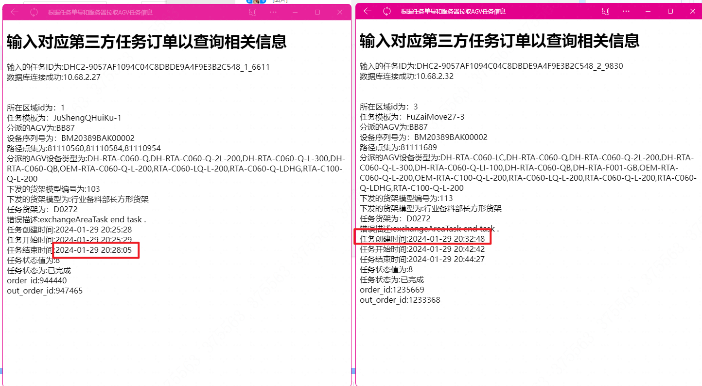
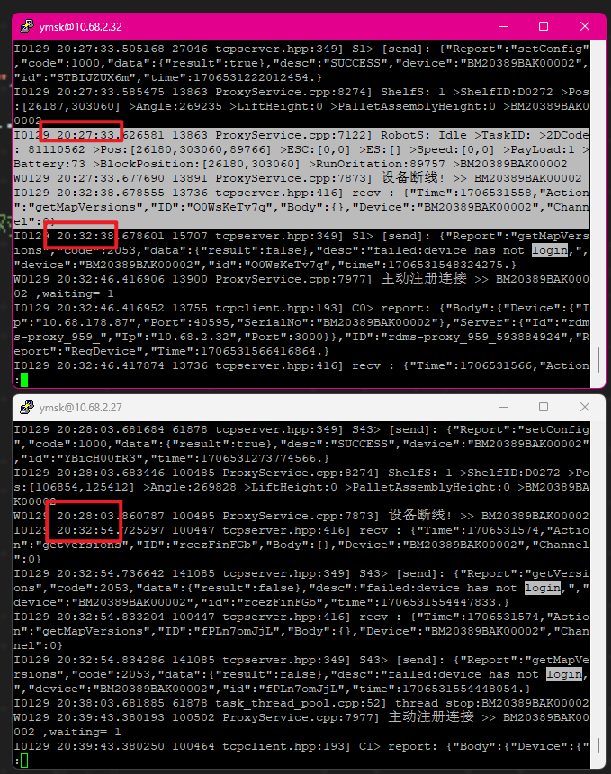
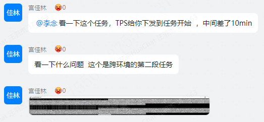
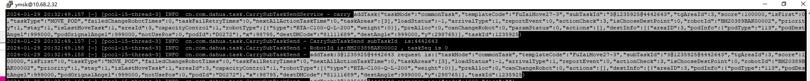
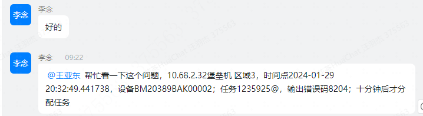
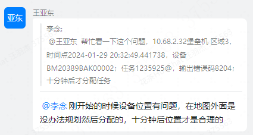
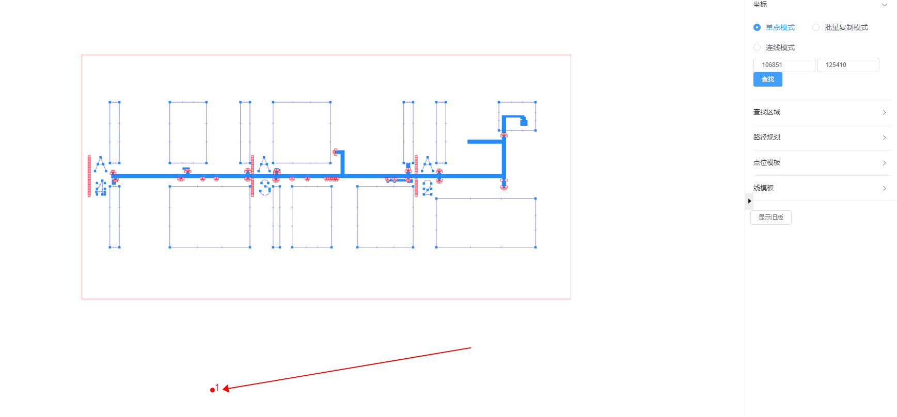

# 设备在交接点停了5分钟

## 时间点

20：28开始
20：32到32服务器

## 设备信息

BB87 BM20389BAK00002 10.68.178.87 RTA-C100-Q-L-200

## 服务器日志32

less INFO_20240129-202213.13726 | grep BM20389BAK00002 | less

## 服务器时间

2.32比2.27快5分钟

## 问题解决

