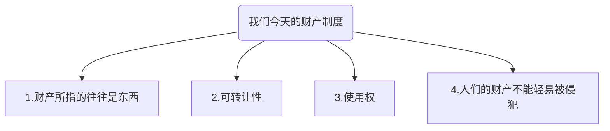

# 《算法的力量：人类如何公共生存？》

## 导论

政治学观念中，最关注四个最基本概念的原因：

- 力量：强者如何统治弱者
- 自由：什么被允许，什么被禁止
- 民主：人民如何统治
- 社会自由：我们对彼此负有何种责任

作者写这本书的原因
> 如果技术的发展是如此之快，快到我们缺乏相应的智识机制去解读它们，我们要怎么办？如果我们轻率地创造出了一个连我们自己都搞不明白的未来，又该如何是好？那就更别提去控制它了。

数字技术和政治之间的关系是什么？
> 作为整体的技术
数字技术

## 第一部分 数字生活世界

### 第一章 日益强大的系统

功能日益强大的系统，就是在很多任务和活动中的表现跟人类差不多（第一章）

### 第二章 日益综合的技术

日益综合的技术，它们总是包围着我们，嵌入自然的或是人为构建的环境之中（第二章）

- 无处不在
- 连接性
- 敏感性
- 沉浸性

### 第三章 日益量化的世界

日益量化的社会，越来越多的人类活动（我们的行动、表达方式、动作和情感）都作为数据被捕捉和记录了下来，然后由数字系统进行分类、存储和处理（第三章）
五路可退？
什么是政治？

> 这一点很重要，因为任何主持过会议的人都知道，阻止某事发生或被改变的最可靠方法，就是干脆不要把它提上日程。

### 第四章 像理论家一样思考

概述了数字生活世界发起的政治和智识挑战，以及我们用来应对这些挑战的理论工具

#### 政治理论

- 概念分析
  - 概念分析就是试图去了解当人们在谈论政治时，他们在谈论的是什么的过程。
师者传道授业解惑也。在大学的研讨会上，优秀的教师不断测试他们的学生直到其论述消除了一切模糊不清的地方。
  - 概念分析还涉及试图理解概念的道德内涵及其意义
概念分析将准确性置于首位，正是为了拨开迷雾。

- 规范分析
  - 规范分析，即试图判断政治领域中非善恶的方法，与道德哲学和伦理学紧密相关。
我们对彼此负有何种正义的责任？我们是否有义务参与公共生活？我们享有做何种事情的自由，什么事情是应被禁止的？

  >规范分析使我们能够通过反思和争论来确定原则，从而指导我们如何共同生活。
- 语境分析
  - 语境分析是用来找出概念从何而来、为何能出现、在它们的构思过程中被赋予了何种含义，以及其含义是如何随着时间改变的。

#### 政治思想的未来

三种思路可供参考

1. 无论你喜欢与否，我们都是政治理论家
2. 政治理论应牢固地扎根于生活事实
3. 政治理论应该为我们如何共同生活提供有实际意义的指导

## 第二部分 未来的权力

> 哪里有活物，哪里就有对权力的渴望；从一个仆人身上，我也能闻到他成为主人的渴望。
——弗里德里希·尼采，《查拉图斯特拉如是说》（1891）

### 第五章 代码就是力量

> 几乎所有人都可以忍受逆境，但如果你想测试一个人的品格，不如给予他权力。
——亚伯拉罕·林肯

中心论点：
> 某些技术将成为数字生活世界的强大力量

未来的权力

- 数字技术（主要来源）
- 武力
- 审查
- 感知控制

权力是什么？
什么能让一个人或实体有权力？

- 其权力范围
- 有权势的个人或实体，其权力涉及重要事务
- 权力的稳定性

> 总结：一个人或实体是强大的，在于其据有稳定且广泛的能力，迫使其他人或实体去做某些他们本不会去做的重要事情，或者不做他们本来会去做的事情。

权力的不同面孔

- 武力
- 强制
- 影响力
- 权威
- 操纵

数字技术与权力
代码与算法
> 算法这个词描述了用于执行任务或解决问题的一组指令
算法是公式，代码则是该公式在编程语言中的表达式

代码就是力量
>代码同样可被用于影响和操纵人，不过其方式与法律的运行方式不同

代码帝国
>随着虚拟现实系统越来越受欢迎，有些人就会沉浸在完全由代码构成的宇宙中——在那里，代码不仅是权力，也是本质与现实。

代码的未来
>有时，它似乎也缺乏理性或不太公平。然而，这就是权力。

### 第六章 武力

>其中一些技术将通过对人类施加某种武力发挥作用
武力是权力最纯粹也最直接的表现形式

未来几年将发生三个重要的变化

1. 武力数字化
2. 武力私有化
3. 武力自动化

> 智能合同与正常合同的不同之处在于其达成是基于规范，而非基于双方的可信赖度或谨慎程度。正因如此，它们就更难被违反。

#### 适应性法律

#### 代码化的法律

>法律将越来越多地以代码而非文字的形式出现，它将逐渐取代成文法

#### 武力的私有化

>说科技公司不会对我们施加影响，因为我们可以选择退出，就类似于说墨索里尼不是独裁者，因为意大利人可以移民。

#### 武力自动化

畅享想：出现能够在不受人为控制的情况下施加武力的自主数字系统的可能性。

想让这样的系统稳定运行，需要三个特征。

1. 首先，它们必须在某种意义上是“自我指导”（self-directing）的，即被充分编码以执行其功能，而无须任何进一步的人为干预。
2. 其次，这样的系统必须是能“自我维持”（self-sustaining）的，即能在没有人类帮助的情况下良好运转相当长的时间。
3. 最后，此类系统在功能上必须是独立的，从这个意义上说，它们不可能轻易被寻求重新获得控制权的人类主人接管。

### 第七章 审查

> 其他技术将会通过手机和存储我们的私密信息来规训我们，以此发挥它们的作用，甚至在我们使用它们之前就预测我们的行为。

－

>最精明老练的政治领导人知道，强迫别人就是要控制他们的身体；同时要影响或操纵他们，从而控制他们的思想。

探讨未来在不使用或不威胁使用武力的前提下，如何能让人们去做他们原本不会做的事情。
重点：

1. 审查：收集、存储和处理有关他人的信息的能力。
2. 感知控制：控制他人所知、所想和他们准备发表的对世界的看法。

#### 什么是审查？

>有一种权力，它能看见别人却又不被别人看见，它能了解其他人，却又能保持自己不被别人所知。纵观历史，弱者一直努力躲避审查，同时要求强者保持透明。

- 将来，受到审查将成为常态，完成大部分搜集工作的主要是机器，而不是人类。人们的所作所为将越来越难以逃避技术的关注。
- 此外，那些掌握审查手段（能收集和处理信息的技术）的人，对其他人的控制力将会大大增加

#### 审查的力量

其最深远的含意在于权力。

##### 1. 辅助

- 审查的辅助功能非常简单直接：你对某人了解越多，你就越容易让他服从于你的权力，无论是通过武力、强制和影响力，还是权威和操纵。
- 信息本身不是权力，却有助于获得权力。审查的辅助功能就是收集此类信息。

##### 2. 规训

审查导致自我规训这一观点一般被认为来自福柯。

>审查本身可以被视为一种强制。它不会强迫你做任何事情，但确实会鼓励你出于对不良后果的担心而进行自我监管，无论这种后果是真实的还是想象的。

#### 数字生活中的审查

数字生活世界将带来人类相互监督能力的变革，它在五个方面与过去不同。

1. 人类整个生命中不可记录的那部分，或是因过于复杂而无法窥其全貌的部分，将能够通过各种审查手段来观察和理解。社会现象的可读性因此将大大增加。
2. 这种审查将会越来越私密，甚至发生在我们此前看作“私人”领域的地方。
3. 通过审查搜集到的信息也许会更加“不朽”，始终活在人们的记忆中，甚至贯穿整个人生。
4. 对负责展望未来的机器来说，人的行为的可预测性将越来越强

##### 私密

设备对我们的窃听程度远远超过我们的理解能力。

##### 不朽

>用威廉·福克纳（William Faulkner）的话来说，在未来，“过去永不消逝。过去甚至还没有过去”

##### 可预测

##### 评分

##### 审查：含义

### 第八章 感知控制

>有什么办法比创造一种仅是批评一下现状都是不可接受的环境还更有利于维持现状呢？
-----
>如果我违反了一项规范或习俗，我可能不会像违反法律那样受到武力制裁，但后果可能会更糟：嘲笑、羞耻、排斥、孤立，甚至放逐。

#### 20世纪的感知控制

#### 数字生活世界的感知控制

1. 新闻
2. 搜索
3. 通信
4. 情绪
5. 即时的感官体验

#### 感知控制：含义

>以我们的自由、民主和社会正义的要求为背景，那些看似技术上的决定往往是政治上的决定。

### 第九章 公私权力

>政治的主要后果，就是使那些掌握了技术力量的人控制其余人的能力更加强大。有两伙人将得利最多，即政权和大型科技公司
-----
>在孩子手中放一根炸药并不能使他变得强大，只会增加他不负责任的危险。
——刘易斯·芒福德，《技术与文明》

#### 谁控制谁？

>如果前面四章是在接近事实的真相，那么接下来我们就需要认真思考未来谁拥有权力，谁受制于权力。这就是本章的写作目的。

#### 科技公司的政治

#### 火力”权“开

## 第三部分 未来的自由

### 第十章 民主的梦想

>数字生活世界将成为执法系统的地盘，这个系统对其统治下的有缺陷且不完美的人们来说，也许使太过“有效率”了

#### 三种形式的自由

- 行动自由
- 思想自由
- 结社自由（共和主义的自由概念）
  - 首先，一个自由的社群通过追寻其公民意志来进行自我管理，不受外部干涉。
  - 真正的自由来自政治参与和西塞罗所说的“美德”（virtus）的发展，意大利理论家后来将其翻译为virtù，英语共和主义者将其翻译成“公民美德”（civic virtue）或“公共精神”（public-spiritedness）。
  - “实际自由”比那种所谓的“绝对自由”更重要，这是英国革命和美国革命的关键区别。

依赖强者约束的自由根本不是一种自由。

#### 数字解放

- 新的功能可供性
- 增压的国家
  - 法律帝国的扩张
  - 预测的政治
    基于一种运行完全不透明的算法，个人自由是可以受到限制的，这一看法正好与共和主义自由的理想相悖。
  - 道德自动化
  - 极权主义的大潮
  - 数字化的异议
    - 服从自己的良心比服从法律更重要，而违反法律可以被认为是鼓励改变法律的一种方式。
    - 政治黑客
    - 密码学
  - 明智的限制

### 第十一章 科技公司与自由

#### 言论自由

>我们将依靠社交媒体和通信平台设置的限制
道德自主性

我们则将依靠那些决定我们在它们运营的数字系统中“什么可做，什么不可做”的判断。

从自由的角度来看，国家所掌握的权力与科技公司所掌握的权力有四个重要区别。

国家所掌握的|公司所掌握的
:-|:-
民主国家要对人民负责，公民也对管理他们的规则有实质意义上的发言权。权力可以被问责|它们制定规则，我们接受规则
国家的存在是为大众利益服务的|为其所有者的商业利益而存在
成熟的法律制度是根据明确的规则和准则，随着时间的推移系统发展起来的|私有代码以一种特殊的、不一致的方式开发出来
复杂|比政府的运作方式更加难以捉摸

#### 伤害的原则

- 不道德却无害

#### 数字自由

==数字共和主义者的口号可以说是要求透明、责任和参与。“去编程吧，否则就要被程序编进去了！”==

#### 自由和民主

## 第四部分 未来的民主

### 第十二章 民主的梦想

#### 民主的故事

- 民主是什么？
  - 定义：“民主”这个词通常指的是一种政府形式，其最终的政治权利掌握在多数人（人民、群众、多数派和被统治者）手里，而不是少数人（君主、独裁者和寡头）手中。
    - demokratia（民主） = demos（人民） + kratos（统治）
  - 古典民主
  - 自由的民主
    - 不受控制的民众和不受控制的君主一样坏：“当人人都能肆无忌惮地作恶时，他们也会犯同样的错误。”
  - 竞争性精英主义
  - 互联网出现后的民主
    - >互联网本应改变民主
- 为什么要民主？

### 第十三章 未来的民主

政治和科技精英们所掌握的力量的增长，将迫切要求公民追究这些精英的责任的力量同步增长。

- 协商民主
  - 协商时共同体成员理性地讨论政治问题，以找到所有（或大多数）理性人士都能接受的解决方案的过程。
    - 在理想的协商过程中，每个人都有平等参与的机会，任何人都可以对议题或讨论方式提出质疑。
  - 感知控制
    - 我们已经看到，在未来，我们如何感知世界将越来越多地由数字系统所揭示或隐藏的东西决定。
  - 碎片化的现实
    - 第二个威胁来自公共话语的瓦解与极化：信息茧房。
  - 谁去了那里？
    - 在会议中，你不可能隐藏你的身份、立场或利益。隐藏就完全违背了集会和协商的意义。
  - 生存，还是机器生存？
    - 如果你想让人们憎恨你的敌人，那么一个策略就是伪装成你的敌人，说一些令人反感的话。
  - 认知流行病
- 直接民主
  - >在直接民主中，人们就某一议题直接投票，而不是选举政治家为他们做决定。举手表决，一堆选票，一片欢呼声，这就是最纯粹的民主。
- 维基民主
  - 维基百科
  - 开源软件
    - 共同对等生产或开源生产：在没有自上而下控制的情况下进行的活动
    - 众包：在集中指导和控制更多的地方
  - 事实是，维基民主需要刹车片，也需要控制、检查和平衡，这一点并不意味着它是非法的或不可能的。
- 数据民主
  - 最终的政治权利属于人民
- 人工智能民主
  - 人民的呼声，人工智能的呼声
- 民主的日子

## 第五部分 未来的正义

### 第十四章 分配的算法

算法将在重要的社会物品的分配上发挥关键作用

- 就业
- 贷款
- 住房
- 保险

-----

- 社会正义是什么？
  - 广义上来说：每个人得到的应是他们应得的东西，不能多也不能少。
- 思考社会正义的两种方式
  - 分配正义
    - 指的是在社会中应如何分配资产
    - 优先主义（prioritarian）
      - 一般来说，你越不富裕（即使你并不那么穷困潦倒），你对社会资源的道德诉求就越强。
      - 不关心穷人和富人之间的整体差距，觉得只要不太富裕的人能得到优先考虑就行。
    - 市场与国家
      - 市场悲剧性的缺陷在于，它能总体上有效地分配资源，单不一定是公正的。
        - 市场的逻辑并不能保证最穷的人得到足够的钱，或者使他们享有优先权，提供平等的机会，让人们得到他们应得的东西（无论你倾向于哪种分配正义的原则）。
        - 根据人们愿意付出多少来分配资源并不意味着资源会按正义的要求来分配。
      - 国家的主要经济职能之一就是规范市场
        - 明确什么可以拥有、购买和出售，以及在什么条件下可以拥有、购买和出售（包括如禁止买卖人口的规定）
        - 这能放置一些最严重的不公正情况出现。国家也经常要自掏腰包，使自己有能力将资源导向正义所要求的地方（例如，为失业者或病人发放福利）。
  - 承认正义
    - 承认正义事关人们应如何彼此看待和相处，涉及人们的社会地位和尊重体系。

- 算法分配
  - 算法和分配
    - 它将与市场和国家一起决定我们获得重要社会物品的途径。这使得算法成为一种新的、重要的分配正义机制。
  - 算法和市场参与
  - 算法和信息
  - 算法和价格

### 第十五章 承认的算法

算法也将更多地用于分类、排名、打分，把我们按地位和声望划分到各个社会阶级中去。

- 承认中的不公正的两种形式
  - 客观的不公正
    - 原因：等级制度
    - >如果你处于社会的最底层，如身为“错误的”种姓或阶级，那么i的低下地位很可能导致你缺乏就业机会，拥有较少的经济资源。
    - 同样，如果你一贫如洗，流落街头，那么你的社会地位也不太可能很高。
    - 分配和不被承认往往是不公正的两个方面。
  - 主体的不公正

#### 法律和规范

#### 算法和承认

- 算法在争取承认的斗争中有三个方面的重要意义
  - 数字的不尊重
  - 数字排名
    - > 我们从收入中获得的自尊和社会地位，更大程度上取决于我们同龄人的收入，而不是我们客观上挣了多少钱。持续的社会比较只会加剧这一令人遗憾的缺点。
  - 数字过滤

#### 从算法角度思考正义

### 第十六章 算法不公正

曾经，能羞辱或贬低我们的只有其他人，限制范围则扩大到了机器。这种变化对社会争议的影响是深远的。

#### 速成测试

#### “算法歧视”

算法歧视（algorithmic discrimination）
算法偏见（algorithmic bias）

- 算法的不公正
  - 基于数据的不公正
    - 不管算法有多聪明，若给它灌输的都是对世界的片面或误导性的看法，它就不会公正地对待那些被隐藏在其视野之外或光线暗淡处的人。
  - 基于规则的不公正
    - 显性的不公正
      - 根据表面上看起来就不公正的标准来决定有关分配和承认的问题。
    - 隐性不公正的规则
      - 不直接单独粗暴对待任何特定个人或群体，而是间接地使某些群体受到不如其他群体的待遇。

#### 中立谬误

关于算法，最令人沮丧的事情之一是，即使其应用规则刻意在群体之间保持中立，它依然可能导致不公平。为什么会这样？因为中立规则会重复和巩固世界上已经存在的不公正。

>前段时间很流行的一个说法，“胖虎揍大雄，你不插手你实际上就是在帮胖虎”。明知正在发生不公平的事情、也有去影响它的能力却不作为，这种情况实质就是在纵容不公的泛滥。

因此，中立算法可能会重现世界上已经存在的不公正，并将其加以制度化。

>诺贝尔奖得主埃利·威塞尔（Elie Wiesel）认为：“中立帮助的是压迫者，而不是受害者。”

#### 编码良好的社会

### 第十七章 技术导致失业

可能导致大规模的“技术失业”

>你是为了生活而工作，还是为了工作而生活？将来，可能两者都不是。

工作范式（work paradigm）：即需要通过工作来获得收入、地位和幸福的理念。

- 在工作范式的范围内考虑应对技术导致事业的三种方式
  - 将工作视为稀缺资源
  - 给与人们工作的权利
  - 或者完全抵制自动化

#### 技术导致失业

##### 论点

- 技术导致失业
  - 第一阶段，需要做的工作在总体上会减少，单还是足够分配的。下岗工人可以接受再培训，然后上岗。
  - 随着时间流逝，失业者会发现剩余工作的数量在不断缩水，他们也很难再获得上岗所需的培训和资源。
  - 失业人数增加，就业竞争也会变得异常激烈。大多数仍在工作的人会面临降薪。
  - 当机器的工作能力和可靠性达到一定水平后，雇佣人力来完成经济任务在经济上就毫无意义了。
  - > “工人已经变成了一种商品，能找到买主对他来说就已经很幸运了。”————马克思
  - 总的来说，经济的蛋糕会变大，但人类工人分得的蛋糕会越来越小。
- 谁会是最先失业的人？

##### 工作范式

古人不喜欢“为了生计而工作”的想法。

- 我们今天为什么要工作呢？
  - 收入
    - 谋生是人们工作的首要目的。
  - 地位
    - 我们工作也是为了满足自己对地位和他人尊重的需求，人类的这种需求是根深蒂固的。
  - 幸福
    - 终于，总有些幸运儿的工作帮助他们提升了幸福感。这种幸福感可能来源于业绩出色使他们获得了内在满足，也可能来源于他们给其他人带来了价值。

###### 工作模式下的三个应对方式

- 稀缺资源
  - 把工作当作稀缺资源，这种应对措施无法有效应对技术导致失业的挑战
- 劳动权（right to work）
  - 与“仅为解决就业而制造工作”的人为计划相配合，该计划旨在为每个人提供工作，让他们忙碌起来。
  - 创造足够多的非必要工作岗位并为此支付报酬，不仅极其低效，甚至根本就是不可能的。
- 反抗
  - >第三种可能的应对是试图通过某种全球技术暂停来抵制自动化进程。我不人为这种方法具有可行性。

##### 后工作范式

事实上，技术导致失业可能提供了一个机会，可以废除原有的工作模式，代之以一套不同的理念。简言之，这种理念意味着削弱甚至切断工作与收入、地位和幸福之间的联系。

1. 削弱工作与收入之间的关系
   1. 工作和收入之间没有必然联系。
   即使在现行制度下，工作也不能保证你有一份生计。
   2. 机器人税
   3. 全民基本收入（UBI），给每个公民支付现金，且“不附加任何条件”
2. 切断工作与地位之间的关系
   1. 挑战一种在工作范式种或许是最根深蒂固的观念：只有从事有报酬的工作才配享有地位和尊重，而失业则是耻辱和羞愧的来源。
   2. 如果其他人都失业了，失去工作还会是一种耻辱码？“失业”这个词将失去其意义，也不会再有羞耻的问题了。
3. 切断工作与幸福之间的关系
   1. 最后一个有智力含量的步骤，是挑战工作与幸福之间的联系。

### 第十八章 财富的旋风

==“财富旋风”==
>未来的经济可能只对一类精英阶级有利，那就是生产性技术的“拥有者”，而剩下的大多数则须努力挣扎着抢夺那块份额不断萎缩的蛋糕

#### 数字生活世界中的资本

>在数字生活的世界里，拥有东西的人将比做事情的人更快致富。

- 谋生的方法有两种
  - 通过劳动
    - 通过生产性劳动获得报酬、薪金和奖金
  - 通过资本
    - 能够产生财富的资产
    - 资本
      - 土地（能产生租金）
      - 股票（能产生股息）
      - 工业机械（能产生利润）
      - 知识产权（能产生使用费）

##### 优质财富资本

优质财富资本——土地、股票、工业机械等——将成为数字生活世界的重要收入来源

##### 生产技术

任何生产技术都不能确保所有者具有永久经济优势。
通过自动化获得优势的工厂，其优势会在其他工厂同样实现自动化后消失。

##### 数据

数据可能成为数字生活世界中最重要的资本形式之一。
数据将成为数字生活世界的经济命脉。谁控制了它，谁就拥有了巨大的经济影响力

##### 关键的区别

数字生活世界的关键经济区别僵尸那些拥有资本的人和没有资本的人之间的区别。资本所有者将有机会积累越来越多的财富，而那些只有劳动力可以出卖的人会发现，维持收支变得越来越难。

#### 集中将会导致什么

科技行业的集中度尤其引人注目。
这些公司的共同战略是获取巨额现金储备，以便通过收购和吸收竞争对手的初创企业来扩大自己的商业优势。

#### ==财富的旋风==

财富旋风：其中心逐渐集中于一个越来越窄的点上，久而久之，它会吸收周围的一切，变得越来越大，并摧毁同赛道上的落后者。

>亚伯拉罕·林肯在 1859 年描述了他所设想的资本主义制度：“谨慎、身无分文的年轻人为了工资先劳动一段时间，节省下剩余的钱，用以购买工具或为自己购置土地……最后雇佣了另一个年轻人来帮助他。”对那些连自己劳动力都卖不出去的数字生活世界的“谨慎、身无分文的年轻人”来说，哪里有什么希望呢？

#### 私有财产范式

我们今天的财产制度有四个基本特征

1. 财产所指的往往是东西。
   1. 不动产指的是土地和房产。
   2. 个人财产指的是汽车、书籍和珠宝等可移动的东西。
   3. 无形财产指的是可以被拥有，但不具物理形态的股份、利息和债务等。知识产权也是一种无形财产
2. 可转让性
   1. 它可以根据公认的规则通过出售或赠与的方式转让
3. 对于你拥有的东西，有明确的规则来规定你能做什么、不能做什么（总的来说，完全拥有个人财产意味着你可以随心所欲地使用它）。
4. 人们的财产不能轻易被侵犯。

- 为什么采用私人财产范式而不是其他体系呢？
  - 据说它能鼓励和促进繁荣
  - >“得不到财产的人，除了尽可能多吃，尽可能少劳动之外，就没有什么值得他关注的了。”   ——亚当·斯密《国富论》
  - 也使财富的再分配更加困难。这是因为它缩小了国家干预市场的可接受范围和程度。
  - >“哪里有巨大的财富，哪里就有巨大的不平等。每个巨富之人的存在，就至少对应存在着500个穷人。”   ——亚当·斯密
  - > 你们对我们打算消灭私人财产感到震惊。但是在你们现在的社会里，十分之九的人口已经没有私有财产了；它之所以存在于少数人之中，完全是由于它不存在于其余十分之九的人手里。    ——马克思和恩格斯《共产党宣言》（1848）

#### 未来的财产

>“我认为，产生大规模、系统性不平等的财富旋风不符合社会正义的要求。我们可能需要涉及一种新的财产权组织方式。其挑战在于：
要找到一种制度，既能保留科技释放出来的经济奇迹，又能让更多人分享这些奇迹。”

#### 新财产范式

##### 资产税

对抗财富旋风的一种方法是对资本或资本获利增税。
税收拿走的是一部分由资本产生的财富，而不是资本本身。

##### 资本国有

富人和穷人都将依赖它们来维持经济运转。着使得它们成了国有化的合适选择，这样一来，它们的运作就可以为所有人的利益服务。

## 第六部分 未来的政治

### 第十九章 透明度和新的权力分割

避免第十八章的命运
透明度
新三权分立

### 第二十章 后政治学

到那个时候，世界的变化如此巨大，以至政治这个概念本身都失去了意义
政治和科技精英们所掌握的力量的增长，将迫切要求公民追究这些精英的责任的力量同步增长。
一个人或实体是强大的，在于其据有稳定且广泛的能力，迫使其他人或实体去做某些他们本不会去做的重要事情，或者不做他们本来会去做的事情。
<!--stackedit_data:
eyJoaXN0b3J5IjpbLTEwOTMzMzIxMTBdfQ==
-->